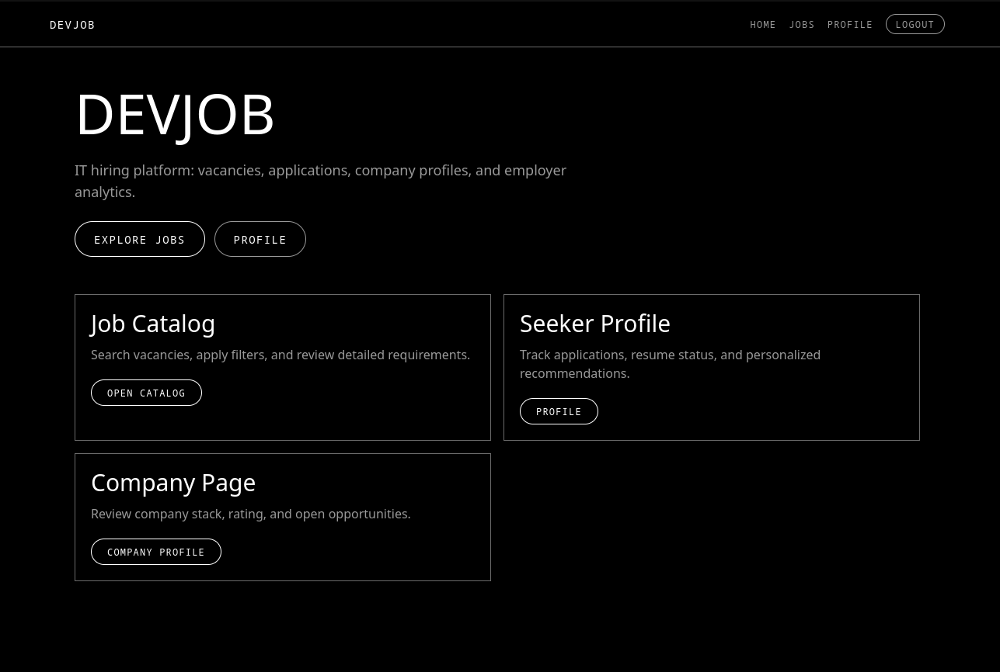
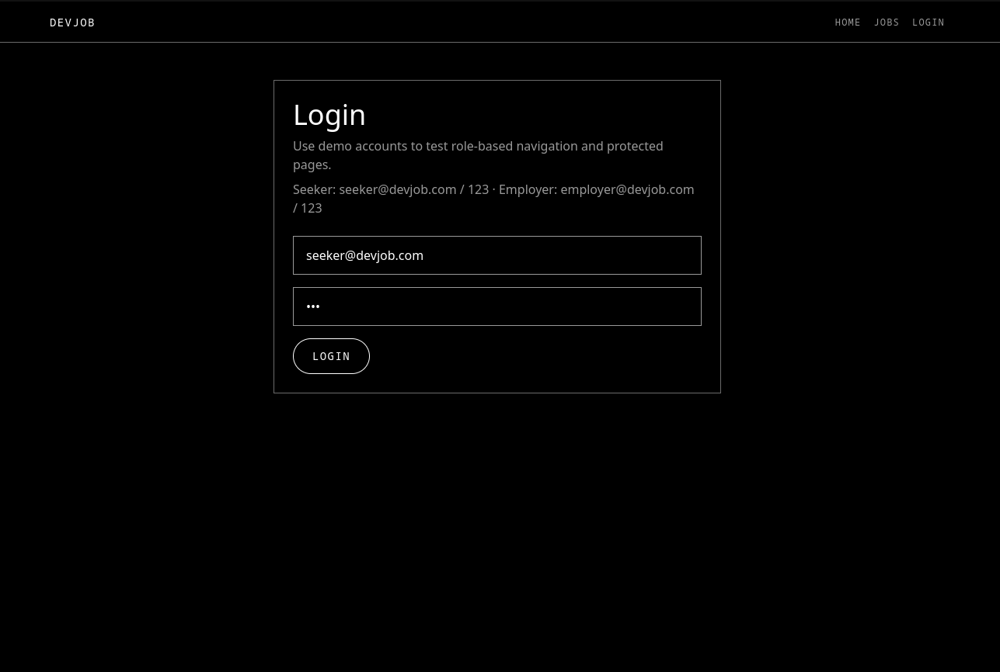
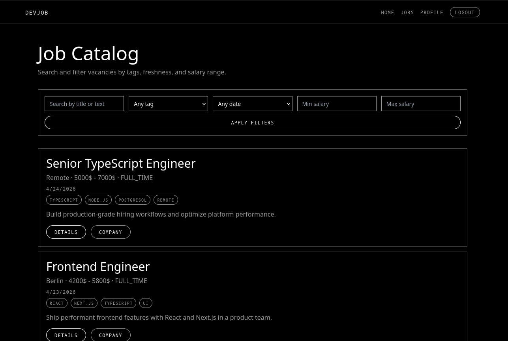
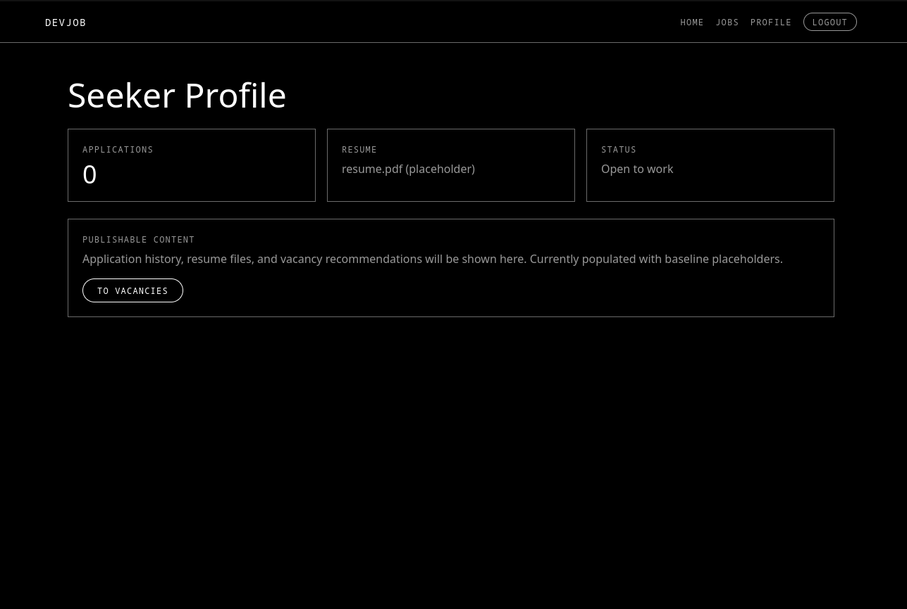
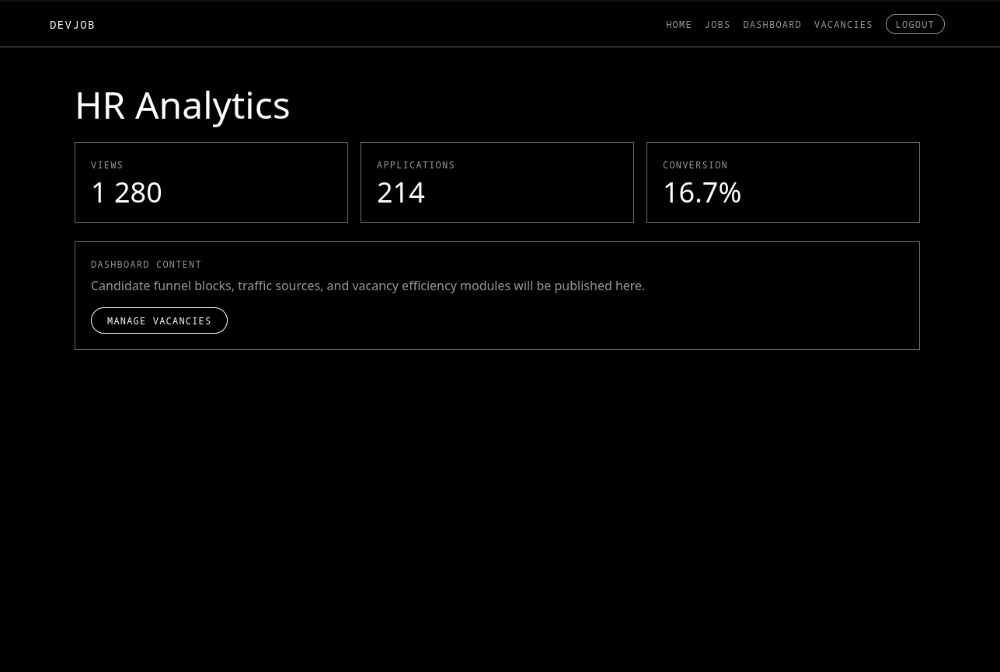

# DevJob Monorepo

DevJob is a full-stack monorepo prototype of an IT job platform with role-based flows for **SEEKER** and **EMPLOYER** users.

The repository contains:
- a backend API (`apps/api`) built with Express,
- a web frontend (`apps/web`) built with Next.js App Router,
- a shared package (`packages/shared`) with canonical Zod schemas.

---

## 1. Project Goals

This project is designed as a practical portfolio/demo platform and a structured foundation for further production hardening.

Current goals:
- demonstrate role-based authentication and route access,
- provide a searchable job feed with filtering,
- enforce API boundary validation with shared Zod schemas,
- keep frontend/backend contracts centralized and reusable.

---

## 2. Monorepo Architecture

```text
devjob/
├── apps/
│   ├── api/               # Express API
│   │   └── src/
│   │       ├── config/    # Environment parsing
│   │       ├── middleware/# Auth + error middleware
│   │       ├── modules/   # Feature modules (auth, jobs, companies, applications)
│   │       ├── prisma/    # Prisma schema placeholder
│   │       └── server.ts
│   └── web/               # Next.js 14 App Router frontend
│       ├── app/           # Pages/routes
│       ├── components/    # Shared UI/layout components
│       ├── lib/           # API client utilities
│       └── middleware.ts  # Route protection by role
├── packages/
│   └── shared/            # Shared schemas/types package
│       └── src/schemas/
├── package.json           # Root workspace scripts
├── pnpm-workspace.yaml
└── tsconfig.base.json
```

### Design principles used in this repo
- **Shared contracts first**: API responses are validated with schemas from `@devjob/shared`.
- **Service-layer backend structure**: route handlers delegate to module-level service logic.
- **Role-aware frontend navigation**: header/menu and protected routes adapt to authenticated role.
- **Small, explicit modules**: no hidden framework magic, straightforward folder-level ownership.

---

## 3. Technology Stack

### Frontend (`apps/web`)
- Next.js 14 (App Router)
- React 18
- TypeScript 5 (strict)
- Tailwind CSS

### Backend (`apps/api`)
- Node.js
- Express 4
- TypeScript 5 (strict)
- JWT (cookie-based auth)
- Zod validation

### Shared (`packages/shared`)
- Zod schemas for:
  - user/auth payload,
  - job entities,
  - company entities,
  - application entities.

### Tooling
- pnpm workspaces
- Vitest (tests)
- tsconfig project references style via shared base config

---

## 4. Implemented Features

### Authentication (demo mode)
- Demo login with two accounts:
  - `seeker@devjob.com` / `123`
  - `employer@devjob.com` / `123`
- Registration is intentionally placeholder-only in demo mode.
- Auth cookies:
  - `accessToken` (session token)
  - `role` (role hint for role-aware UI)

### Job Feed
- In-memory jobs dataset (7+ vacancies)
- Job filters:
  - text query (`q`)
  - tag (`tag`)
  - freshness in days (`freshnessDays`)
  - salary range (`minSalary`, `maxSalary`)

### Access Control
- Guests can browse public pages (including jobs feed).
- Seeker and Employer have role-specific navigation and route access.
- Protected route checks are handled in Next middleware.

---

## 5. API Overview (high-level)

Base URL (local): `http://localhost:4000`

Main route groups:
- `POST /api/auth/login`
- `POST /api/auth/logout`
- `POST /api/auth/register` (demo placeholder response)
- `GET /api/jobs`
- `GET /api/jobs/:jobId`
- `POST /api/jobs` (EMPLOYER only)
- `GET /api/companies`
- `GET /api/companies/:slug`
- `GET /api/applications/me` (SEEKER only)
- `POST /api/applications` (SEEKER only)

---

## 6. Local Setup Tutorial

## Prerequisites
- Node.js 20+
- pnpm 8+

### Step 1 — clone and install
```bash
git clone <your-repo-url>
cd DevJob
pnpm install
```

### Step 2 — run apps in development
From repo root:
```bash
pnpm dev
```

Expected local endpoints:
- Web: `http://localhost:3000`
- API: `http://localhost:4000`

### Step 3 — login with demo credentials
Open `http://localhost:3000/login` and use:
- seeker: `seeker@devjob.com` / `123`
- employer: `employer@devjob.com` / `123`

### Step 4 — use role-specific pages
- Seeker flow: jobs and profile.
- Employer flow: dashboard and vacancies.

---

## 7. Workspace Commands

Run from repository root:

```bash
pnpm dev         # run workspace dev scripts
pnpm build       # run build in all packages
pnpm lint        # run lint scripts in all packages
pnpm test        # run tests in all packages
pnpm typecheck   # run TypeScript checks in all packages
```

Target package examples:

```bash
pnpm --filter @devjob/api dev
pnpm --filter @devjob/web dev
pnpm --filter @devjob/shared test
```

---

## 8. Environment Notes

Current prototype uses defaults defined in API env parsing.

Common local values:
- `PORT=4000`
- `JWT_SECRET=<your-local-secret>`
- `WEB_ORIGIN=http://localhost:3000`
- `NODE_ENV=development`

If you add `.env` files locally, ensure values match your frontend origin and ports.

---

## 9. Testing

Current tests include:
- backend unit tests for jobs service,
- frontend sanity test.

Run all tests:
```bash
pnpm test
```

> Note: in constrained environments (without installed dependencies), test commands may fail with missing binary errors (`vitest: not found`).

---

## 10. Known Limitations (Prototype Scope)

- Data storage is in-memory for core demo entities.
- Prisma schema is currently a placeholder (no active DB integration in runtime flow).
- Registration endpoint is intentionally demo/placeholder mode.
- Security, observability, and deployment configuration are simplified for prototype use.

---

## 11. Suggested Next Steps

- Replace in-memory stores with Prisma + PostgreSQL repositories.
- Add refresh-token rotation and hardened cookie strategy for production.
- Expand test coverage (integration and e2e).
- Add CI pipeline with strict lint/typecheck/test gates.
- Add API docs (OpenAPI) and typed client generation.

---


## 13. Screenshots

Create a folder for images in the repository:

```text
docs/
└── screenshots/
    ├── home-guest.png
    ├── login-demo.png
    ├── jobs-catalog.png
    ├── seeker-profile.png
    └── employer-dashboard.png
```

Then reference them from this README using relative paths:

```md
### Home (Guest)


### Login (Demo Accounts)


### Jobs Catalog


### Seeker Profile


### Employer Dashboard

```

### Practical steps to add your own screenshots

1. Start the app locally (`pnpm dev`).
2. Open the relevant pages in browser (`/`, `/login`, `/jobs`, `/profile`, `/dashboard`).
3. Save screenshots as PNG files with clear, stable names (example: `jobs-catalog-v1.png`).
4. Place files into `docs/screenshots/`.
5. Add/update markdown image links in this README.
6. Commit both image files and `README.md`.

### Screenshot checklist (recommended)

- Use one language consistently in UI for all screenshots.
- Keep the same browser zoom and window size for comparable images.
- Avoid sensitive data in captured UI.
- Prefer compressed PNG/WebP to keep repository size reasonable.

## 14. License

No license file is currently defined in this repository. Add a project license before public distribution.
